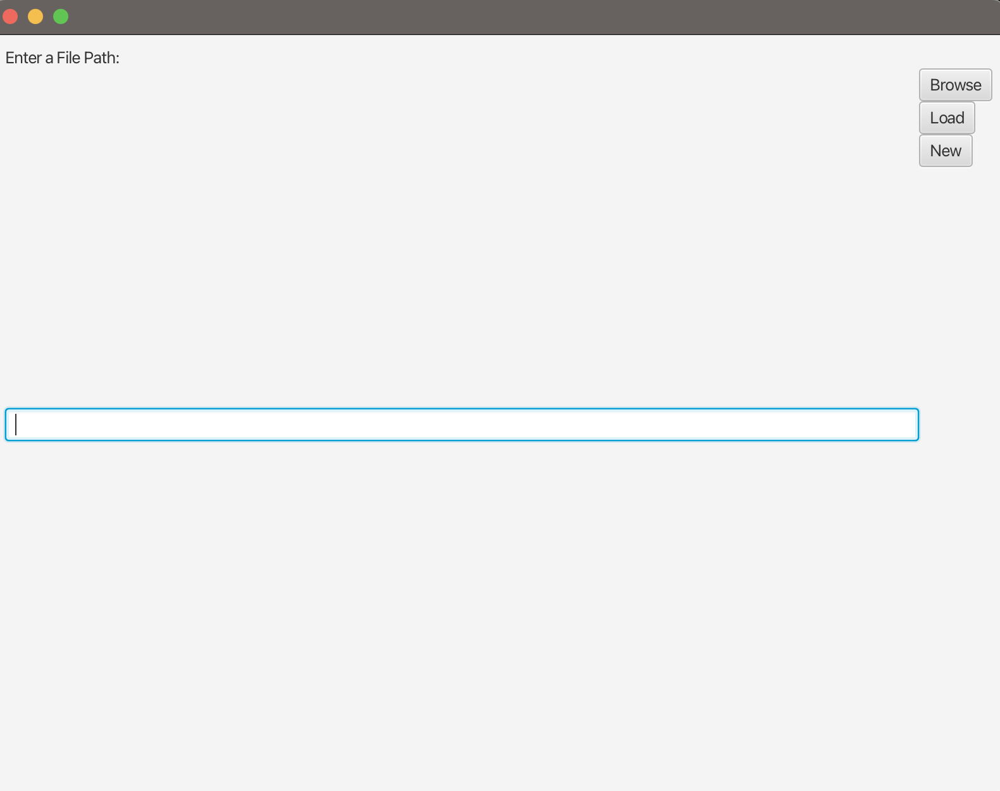
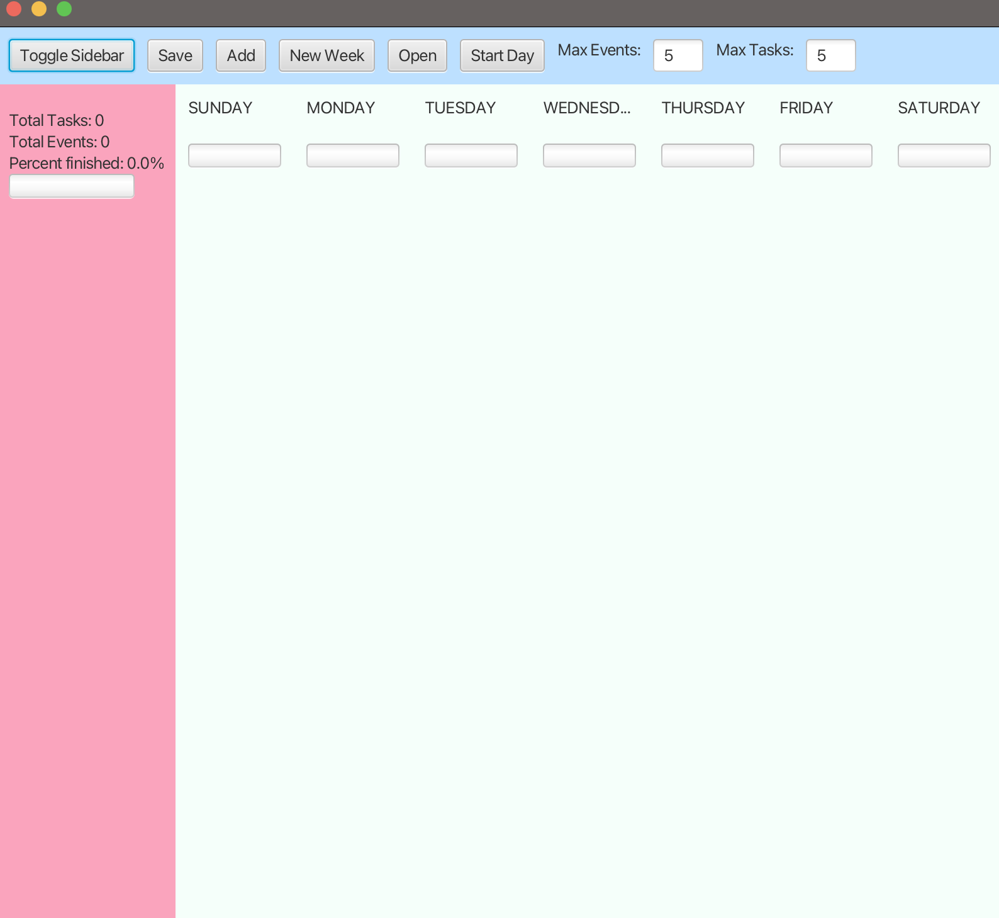

# 3500 PA05 Project Repo

## Pitch
Unlock your productivity potential with My Journal App, the feature-packed app designed to streamline your 
journaling experience!

#### Section 1
- Week View: Effortlessly navigate your schedule with our intuitive weekly view, providing a clear overview of your 
days, events, and tasks.
- Event and Task Creation: Seamlessly create new events and tasks directly within the app's user-friendly interface, 
making it convenient to capture your thoughts and plans on the go.
- Commitment Warnings: Stay on track and avoid overwhelm with helpful warnings and notifications when you exceed the 
maximum number of events or tasks in a day, ensuring a balanced and manageable workload.
- Persistence: Enjoy the convenience of saving and loading journal entries from/to a file, so you never lose your 
valuable journaling data.

#### Section 2
- Task Queue: Take advantage of the expandable sidebar, offering additional functionality and information at your 
fingertips. Effortlessly manage your tasks, view progress, and access key features without interrupting your workflow.
- Menu Bar & Shortcuts: Our app features a sleek and customizable top bar, complete with a range of shortcuts and 
buttons for quick access to essential functions. Create new events and tasks, save your journal, start a new week, 
change the week's starting day, and open bujo files with ease. Customize key bindings to perform actions efficiently.

#### Section 3
- Takesie-backsies: Made a mistake? No problem! Easily delete journal entries directly from the app, giving you the 
flexibility to correct any errors and refine your journaling experience.
- Progress Bar: Track your daily progress with a visual progress bar displayed at the bottom of your tasks. 
Additionally, the sidebar toggle provides an overall progress bar for the entire week, allowing you to monitor your 
accomplishments at a glance.
- Weekly Overview: Stay informed and motivated with our insightful weekly overview. The sidebar presents statistics, 
including the total number of events, tasks, and the percentage of completed tasks for the week, empowering you to 
gauge your productivity and stay on track.

#### Section 4
- Week Start: Tailor your journaling experience to your preferences by selecting the "start day" of your bullet journal 
week. Smoothly transfer events and tasks across days, maintaining order and organization, regardless of the chosen 
start day.
- Mind Changes: Make real-time adjustments to your journal entries effortlessly. Edit event and task details, such as 
names, descriptions, time, duration, and completion status, directly within the week view. Your changes will be 
seamlessly saved as you type, ensuring accuracy and flexibility.

#### Section 5
- Splash Screen: Experience a delightful welcome with our sleek "My Journal App" splash screen, creating a captivating 
introduction to your journaling journey. The screen gracefully fades away within seconds, immersing you into the app's 
initial view seamlessly.

Download My Journal App now and revolutionize your journaling experience!

## User Entering Filepath

## How a New Bullet Journal Displays

