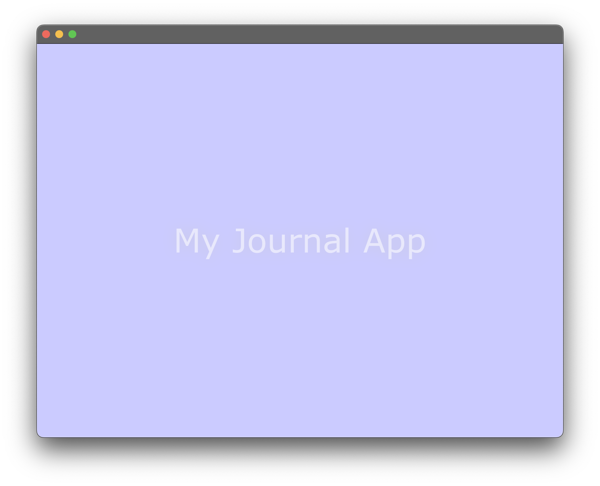
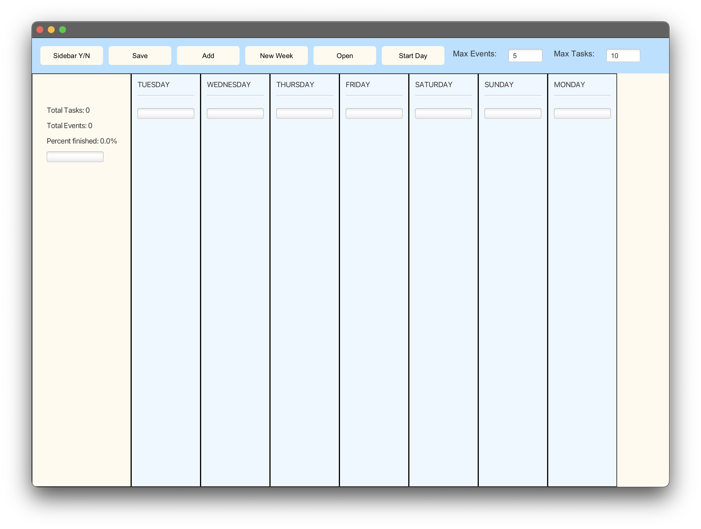

# 3500 PA05 Project Repo

## Pitch
Take control of your schedule with "My Journal App" and discover the perfect blend of simplicity, flexibility, and power in planning. It's not just about staying organized; it's about achieving more.
Our platform is tailored to help you plan your days efficiently and effectively. Some of our features include: 
- Week View: Start planning your week right on our interactive GUI. It neatly displays a weekly view of your planned events and tasks, giving you a holistic view of your commitments.
- Event and Task Creation: We've made it simpler than ever to set up your schedule. Create new events and tasks straight from the GUI with just a few clicks.
- Commitment Warnings: Overbooking yourself is a thing of the past. Our app notifies you if you exceed the maximum number of events or tasks in a day, helping to keep your workload manageable.
- Persistence: Your planning doesn't need to stop when you close the app. Load and save your journal entries with ease, allowing for seamless continuity in your planning.

###### Download My Journal App now and revolutionize your journaling experience!

### Welcome View

### Journal View 

### Use of SOLID

##### Single Responsibility Principle (SRP): 
The Single Responsibility Principle was applied to our project by ensuring that each class had a single functionality.
For example, the EventView class was solely responsible for handling the visual representation and interaction of an event
while the SideBarController was solely responsible for handling the logic behind the sidebar controls.
This made it easier to understand, maintain, and update the codebase, as changes to one aspect of functionality were localized to a single class.

#### Open-Closed Principle (OCP): 
The Open-Closed Principle was implemented through the design of our application's task and event creation system. 
We created an abstract class JournalEntryView which defined a common structure for both EventView and TaskView classes. 
This design allowed us to extend the functionality of our application to handle new types of journal entries in the future without having to modify the existing codebase significantly.

#### Liskov Substitution Principle (LSP): 
We respected the Liskov Substitution Principle by ensuring that the subclasses of our JournalEntryView class could be used in place of the parent class without causing issues. 
For instance, the TaskView and EventView classes, which inherit from JournalEntryView, can be used interchangeably in our GUI without breaking the application, indicating a proper hierarchy of classes.

#### Interface Segregation Principle (ISP): 
The Interface Segregation Principle was applied through our use of abstract classes to define behavior. 
For example, our SideBarController doesn't need to know about all methods of a task or an event; it only interacts with a subset of them. 
To make this clearer and less error-prone, we defined an abstract class for Journal entries such as Events and tasks which our TaskView and EventView classes extend. 
This way, we ensured that classes only have to know about the methods they actually use.

#### Dependency Inversion Principle (DIP): 
The Dependency Inversion Principle was utilized by injecting dependencies into our classes, rather than hard-coding them. 
For example, the EventView and TaskView classes depend on an instance of the Event and Task model classes respectively. 
Instead of creating these instances inside the view classes, they are passed into the constructor. 
This allows for greater flexibility and makes our code more testable, as we can pass different instances or even mock objects for testing.

## Additional features 
An additional feature that can be easily implemented is authentication. 
We could add an authentication factor so users can protect their journals. 
This would be facilitated by adding a login screen after the splash. 

Since JournalEntry is an abstract class, features for our application can be easily extended to include habits for each day. 
This way, users can add events, tasks, or habits to complete for each day. 

