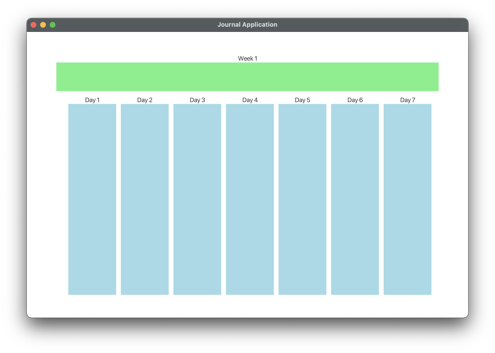

# 3500 PA05 Project Repo

## Basic GUI Implementation for Alpha Release 

This is a sudo GUI not connected with controller as we kept running into issues with module-info file for implementing GUI with controller functionality. Code for this can be found JournalGUI
under view package of main.

[PA Write Up](https://markefontenot.notion.site/PA-05-8263d28a81a7473d8372c6579abd6481)
